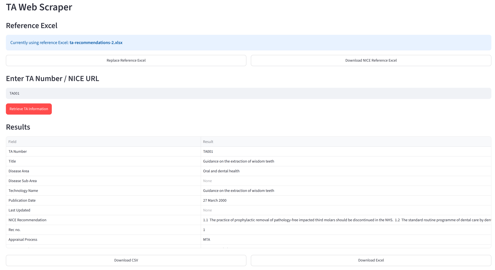
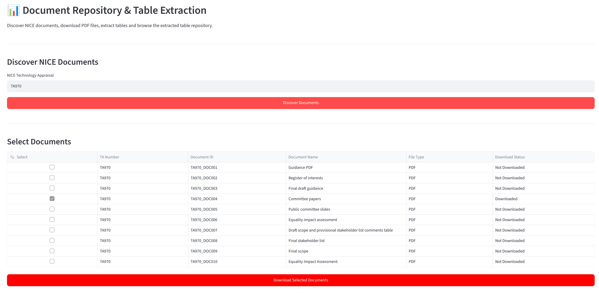
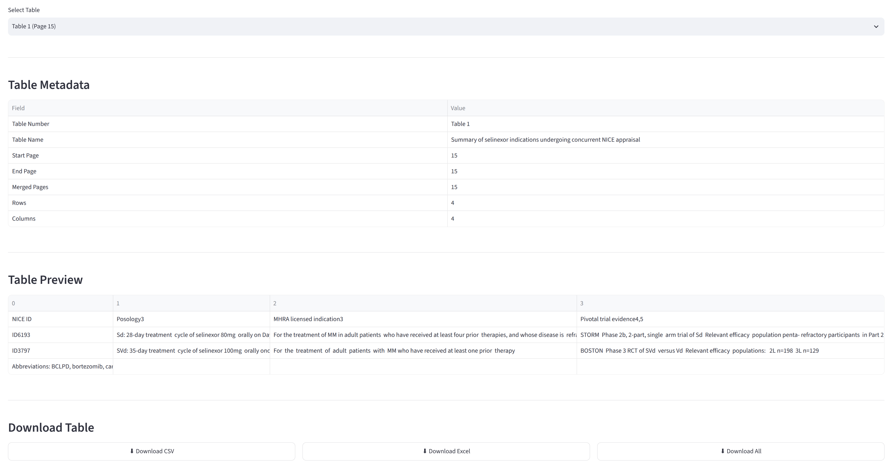

# hta-platform

The HTA Platform is a Python and Streamlit-based application that supports Health Technology Assessment data extraction workflows. It combines web scraping, PDF table extraction and Retrieval-Augmented Generation (RAG) document search into a single application.

This platform was developed by **Shantanu Fulaware** in their dissertation project for their MSc Health Data Science degree at the University of Exeter. It was developed with support from **Dawn Lee** and **Saul Stevens** in the Peninsula Technology Assessment Group (PenTAG) and **Thomas Monks** in the Peninsula Collaboration for Health Operational Research and Development group (PenCHORD).


## Set-up

1. Install Python environment using conda (or mamba). This may take a minute or two to install.

```
conda env create --file hta-platform/environment-vscode.yml
conda activate nice-hta-platform-dev
```

2. Install Ghostscript.

*  **Windows:** Download and install from https://ghostscript.com/index.html.
* **macOS:** `brew install ghostscript`.
* **Linux:** `sudo apt-get install ghostscript`.

3. Install Ollama, either clicking download link in https://ollama.com/download or running:

* **Windows:** `irm https://ollama.com/install.ps1 | iex`
* **macOS:** `curl -fsSL https://ollama.com/install.sh | sh`
* **Linux:** `curl -fsSL https://ollama.com/install.sh | sh`

Run the following command to see a list of installed ollama models:

```
ollama list
```

You can check ollama is running:

```
curl http://127.0.0.1:11434
```

Should return "Ollama is running".

## Streamlit app

1. Change directory to `app`, which contains the Python code and data for the HTA platform.

```
cd app
```

2. Start the streamlit app by running:

```
python -m streamlit run streamlit_app.py
```

3. You should then see a list of URLs - for example:

```
  You can now view your Streamlit app in your browser.

  Local URL: http://localhost:8501
  Network URL: http://144.173.121.70:8501
  External URL: http://144.173.255.198:8501
```

Open a URL in your web browser to view the app, if it doesn't open automatically.

### Web scraper

1. Upload the reference excel sheet. You can find this in the repository: `app/ta-recommendations-2.xlsx`.

2. Enter a TA number (ensure no spaces) or a NICE URL, then click "Retrieve TA information".

It will output the relevant information from NICE. The results can be downloaded as a CSV or Excel spreadsheet.



### Discover NICE documents and Table Extraction

1. Enter a TA number and click "Discover documents".

2. Select the desired documents then click "Download selected documents".



The first document will be available to extract tables from. To switch to a different document, select again in the table and click "Download Selected Documents".

To extract tables...

3. Select the page range to extract tables from. This will raise an error if it exceeds the number of pages in the document, so check the length of the document using "Preview PDF".

4. Click "Extract Tables". You can then use "Select Table" to browse between the selected tables, and download tables to CSV or Excel.



### RAG Question Answering

This section requires you to have NICE PDFs within your `documents/` folder (such as via the "Document Repository" app section).

1. Enter the TA number for the documents you want to use. It should then list the available documents you have downloaded. Choose the relevant document.

2. Select the page range to use then select "Process Document".

3. Write your query, then click "Ask Question".